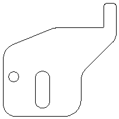

# pic2html

This script creates an html file based on a part.txt and bmp files.

The name of the html file is the name of the current directory.

Part.txt is like a database. It integrates part.txt lines and bmp files into html code.

#### Installation
You do not have to install it.
#### Files
txt2html
#### How to execute the script
```sh
$ chmod +x pic2html
$ sudo cp -p pic2html /usr/local/bin/ && sudo chown root:root /usr/local/bin/*
$ cd <working_folder>
$ pic2html
```
# pic2html_all_folder
This script use the pic2html script.
The difference is that it runs in all subdirectories.
#### How to execute the script
```sh
$ chmod +x pic2html_all_folder
$ sudo cp -p pic2html_all_folder /usr/local/bin/ && sudo chown root:root /usr/local/bin/*
$ cd <working_folder>
$ pic2html_all_folder
```
#### Example
In this example, there are two folders. The ```012345678``` and the ```0123456789```.
```sh
$ ll
összesen 8,0K
drwxrwxr-x 3 user users 4,0K júl    6 10:11 012345678
drwxrwxr-x 3 user users 4,0K júl    6 10:11 0123456789
```
Looks like this, before run the script.
```sh
$ cd 012345678
$ ll
összesen 28K
-rw-rw-r-- 1 user users   76 júl    5 13:15 part.txt
-rw-rw-r-- 1 user users 3,2K júl    6 09:32 AM_BV_lv8_10_1234_1.BMP
-rw-rw-r-- 1 user users 3,2K júl    6 09:32 AM_BV_lv8_10_1235_12.BMP
-rw-rw-r-- 1 user users 3,2K júl    6 09:32 AM_BV_lv8_10_1236_11.BMP
-rw-rw-r-- 1 user users 3,2K júl    6 09:32 AM_BV_lv8_10_1237_22.BMP
-rw-rw-r-- 1 user users 3,2K júl    6 09:32 AM_BV_lv10_18_1238_2.BMP
```
And after the script.
```sh
$ ll
összesen 28K
-rw-rw-r-- 1 user users   76 júl    5 13:15 part.txt
-rw-rw-r-- 1 user users 3,2K júl    6 09:32 AM_BV_lv8_10_1234_1.BMP
-rw-rw-r-- 1 user users 3,2K júl    6 09:32 AM_BV_lv8_10_1235_12.BMP
-rw-rw-r-- 1 user users 3,2K júl    6 09:32 AM_BV_lv8_10_1236_11.BMP
-rw-rw-r-- 1 user users 3,2K júl    6 09:32 AM_BV_lv8_10_1237_22.BMP
-rw-rw-r-- 1 user users 3,2K júl    6 09:32 AM_BV_lv10_18_1238_2.BMP
drwxrwxr-x 2 user users 4,0K júl    6 11:06 html
```
Let see the html folder.
```sh
$ cd html
$ ll
-rw-rw-r-- 1 user users 3,2K júl    6 09:32 AM_BV_lv8_10_1234_1.BMP
-rw-rw-r-- 1 user users 3,2K júl    6 09:32 AM_BV_lv8_10_1235_12.BMP
-rw-rw-r-- 1 user users 3,2K júl    6 09:32 AM_BV_lv8_10_1236_11.BMP
-rw-rw-r-- 1 user users 3,2K júl    6 09:32 AM_BV_lv8_10_1237_22.BMP
-rw-rw-r-- 1 user users 3,2K júl    6 09:32 AM_BV_lv10_18_1238_2.BMP
-rw-rw-r-- 1 user users  504 júl    6 10:11 012345678.html
```
You can see that the name of the html file is the same as the directory name.

#### Image exaple

<p align="center">

<div align="center"><i>The first part example picture.</i></div>
</p>

