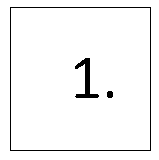

# pic2html

This script creates an html file based on a part.txt and bmp files.

The name of the html file is the name of the current directory.

Part.txt is like a database. 

This script integrates part.txt lines and bmp files into html code.

#### Installation

You do not have to install it.

#### Files

pic2html

#### How to execute the script

```sh
$ chmod +x pic2html
$ sudo cp -p pic2html /usr/local/bin/ && sudo chown root:root /usr/local/bin/*
$ cd <working_folder>
$ pic2html

```

# pic2html_all_folder

The pic2html now embedded in the code.

The difference is that it runs in all subdirectories. This script use "folder.txt".

The "S" character is the separator. Find the dxf file name after the "S" character.

Before you start the script, create the "folder.txt" file, based on the example. 

#### Installation

You do not have to install it.

#### Files

pic2html_all_folder

#### How to execute the script

```sh
$ chmod +x pic2html_all_folder
$ sudo cp -p pic2html_all_folder /usr/local/bin/ && sudo chown root:root /usr/local/bin/*
$ cd <working_folder>
$ pic2html_all_folder

```

#### Example before script

```sh
$ ls -ltrhA
összesen 8,0K
-rw-rw-r-- 1 user users 1,4K júl   20 13:30 folder.txt
drwxrwxr-x 3 user users 4,0K júl    6 10:11 bmp

```

#### Example aftre script

```sh
$ ls -ltrhA
-rw-rw-r-- 1 user users 3,2K júl    6 09:32 AM_BV_lv8_10_1234_1.BMP
-rw-rw-r-- 1 user users 3,2K júl    6 09:32 AM_BV_lv8_10_1235_12.BMP
-rw-rw-r-- 1 user users 3,2K júl    6 09:32 AM_BV_lv8_10_1236_11.BMP
-rw-rw-r-- 1 user users 3,2K júl    6 09:32 AM_BV_lv8_10_1237_22.BMP
-rw-rw-r-- 1 user users 3,2K júl    6 09:32 AM_BV_lv10_18_1238_2.BMP
drwxrwxr-x 2 user users 4,0K júl   14 11:51 .bmp
-rw-rw-r-- 1 user users  148 aug    2 10:18 .folder.txt
-rw-rw-r-- 1 user users   69 aug    2 10:20 pic2html.log
-rw-rw-r-- 1 user users  225 aug    2 10:20 1740040335.html
-rw-rw-r-- 1 user users  226 aug    2 10:20 1740041615.html
-rw-rw-r-- 1 user users  226 aug    2 10:20 1740041648.html
-rw-rw-r-- 1 user users  226 aug    2 10:20 1740041649.html
-rw-rw-r-- 1 user users  228 aug    2 10:20 1740041692.html

```

At the very end of the script, the directory "bmp" is converted to a hidden directory.

And transforms the "folder.txt" file hidden.

#### Image example

<p align="center">

<div align="center"><i>The first part example picture.</i></div>
</p>

